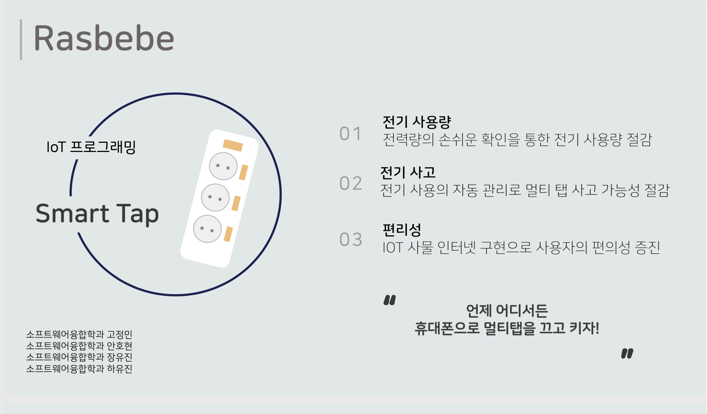
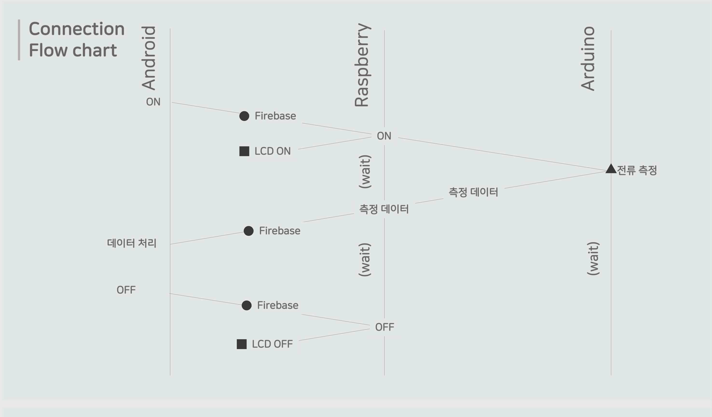
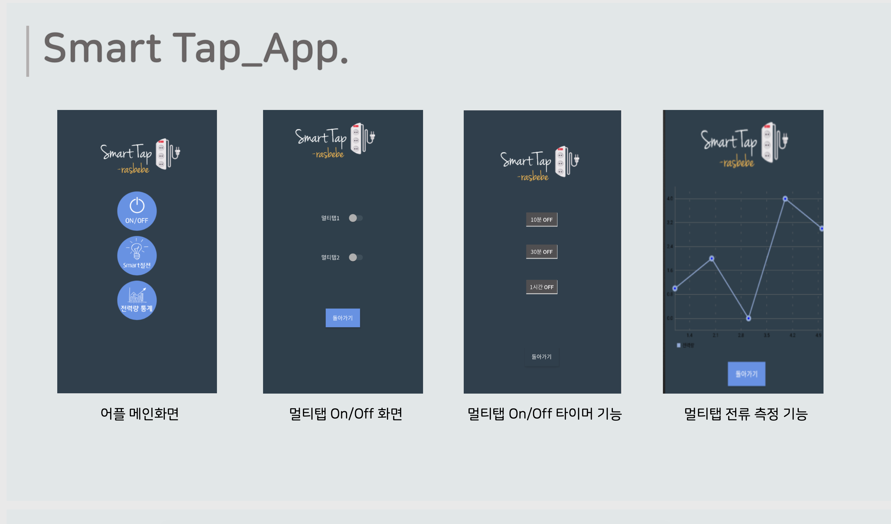
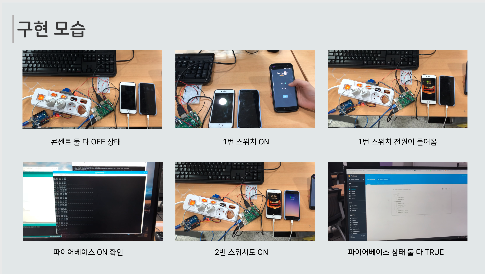

# 스마트 멀티탭 프로젝트

#### 프로젝트 기간
- 2018.11. ~ 2018.12.

## 프로젝트 소개

스마트 멀티탭은 아두이노와 라즈베리파이, 휴대폰으로 멀티탭을 끄고 킬 수 있도록 설계된 프로젝트 입니다.

스마트 멀티탭의 연결 및 흐름도입니다.

스마트 멀티탭의 어플 예시 화면 입니다.

실제로 멀티탭과 연결하여 구현한 모습입니다.

### 사용 부품
* 아두이노
* 라즈베리파이

### 서버
* 파이어베이스

### 클라이언트 어플
* 안드로이드

### 프로젝트 팀원
* 고정민
* 안호현
* 장유진 (팀장)
* 하유진
